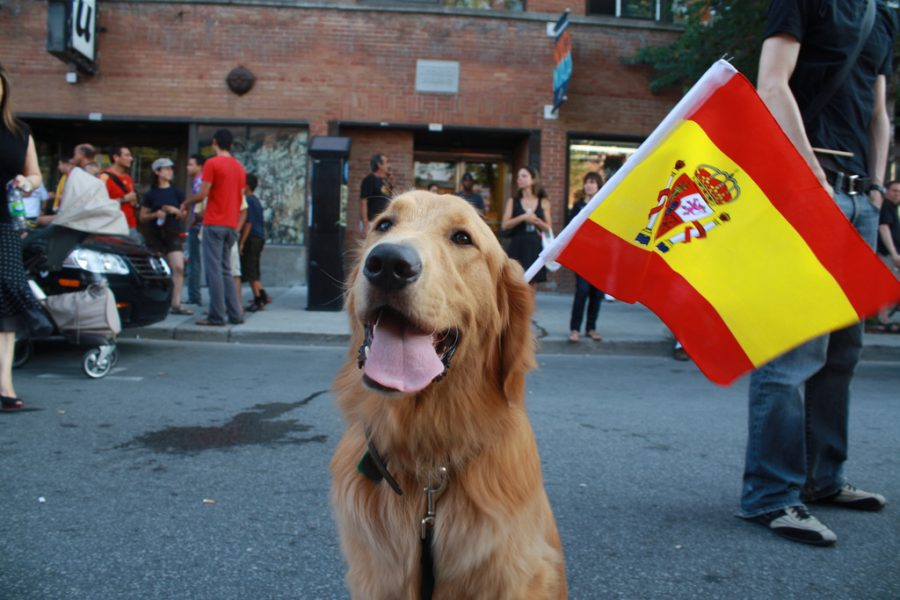

```{r setup, include=FALSE , echo=FALSE}
knitr::opts_chunk$set(echo = TRUE)
```

La clasificación de los nombres de mascotas más populares se puede evaluar, en particular, a partir de registros de seguros de mascotas, registros de microchips y registros de raza.

## Nombres Populares de Perros

Según algunas revistas, estos son los 10 nombres más comunes en España

```{r tablaPerro, include=FALSE , echo=FALSE}
nombrePerros <- read.table("perros.csv", sep = ";", header = TRUE)
```

```{r libreria, include=FALSE , echo=FALSE}
library(knitr)
```


```{r kablePerro , include=TRUE, echo=FALSE}
kable(nombrePerros)
```

> *"Si  los perros van al cielo, cuando muera quiero ir donde ellos van."*

 


## Nombres Populares de Gatos

En esta tabla vemos los 10 nombres populares de gatos en diferentes países:

```{r tablaGato, include=FALSE , echo=FALSE}
nombreGatos <- read.table("gatos.csv", sep = ";", header = TRUE)
```

```{r kableGato , include=TRUE , echo=FALSE}
kable(nombreGatos)
```

> *"El paraíso jamás será paraíso, a no ser que mis gatos estén allí, esperándome..."*

 
